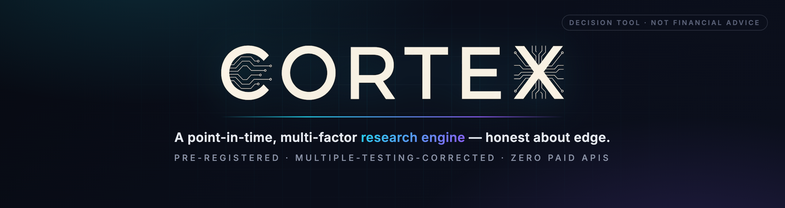
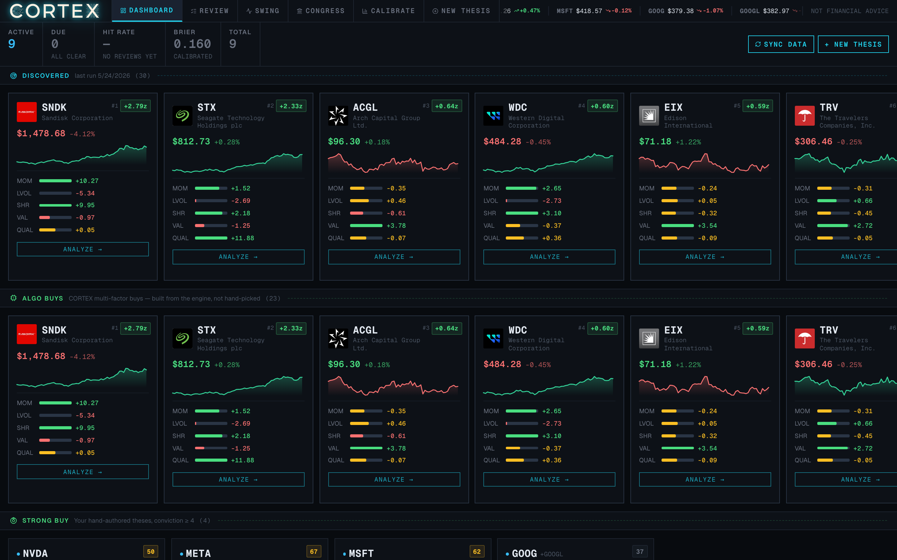
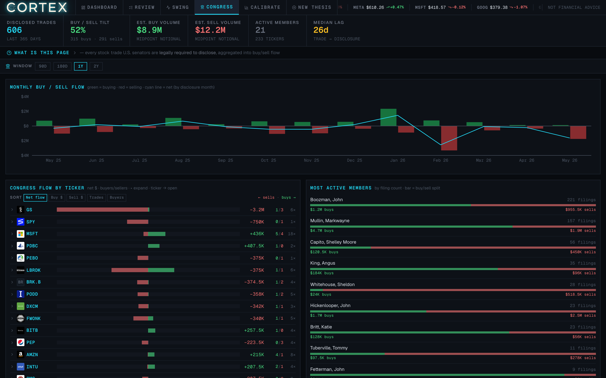
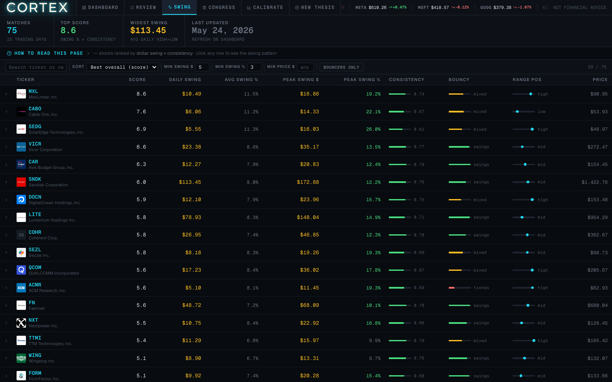
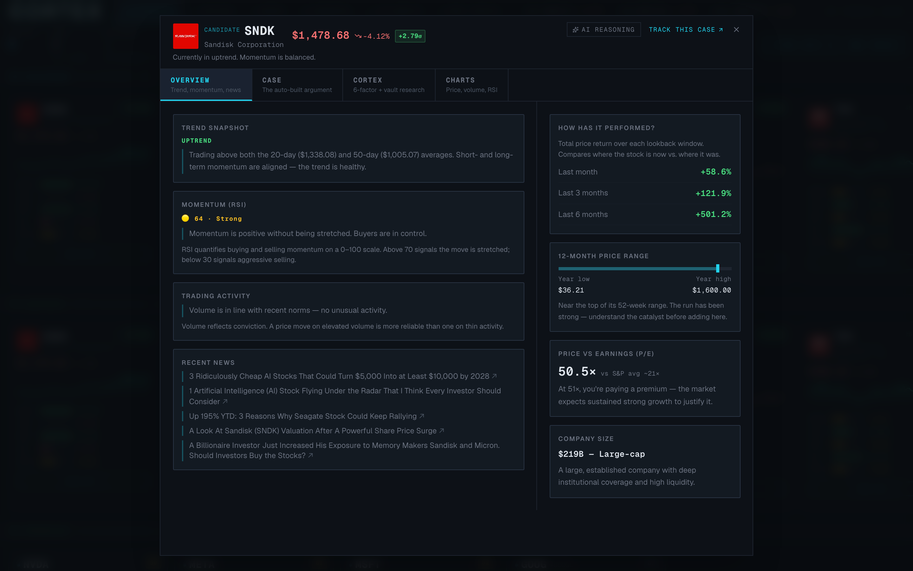
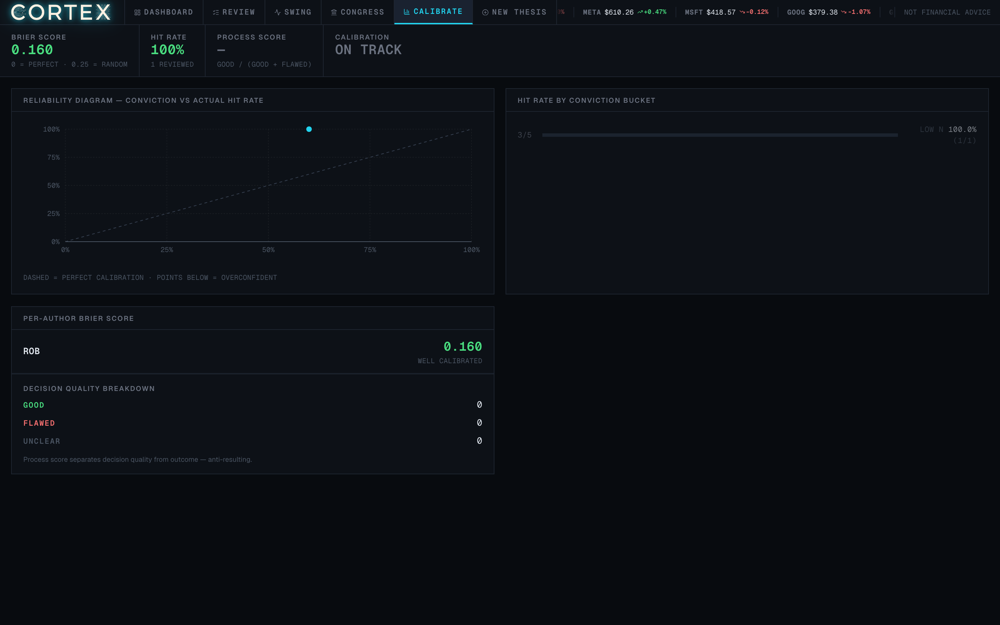

<p align="center">
  
</p>

<p align="center">
  <b>A factor-model research platform that treats investing as a calibrated decision process — not a signal feed.</b><br/>
  <i>Every number on screen is evidence for a decision. Never a recommendation.</i>
</p>

<p align="center">
  <a href="https://www.python.org/"></a>
  <a href="https://fastapi.tiangolo.com/"></a>
  <a href="https://duckdb.org/"></a>
  <a href="web/"></a>
  
  
  <a href="LICENSE"></a>
</p>

---

## What this is

CORTEX is a personal quantitative research platform I built end-to-end. It's a point-in-time multi-factor equity engine over the S&P universe, with an alt-data ingestion layer sourced entirely from free public filings, a decision-quality system that scores my own forecasting calibration, and a glass-premium React portal — all served from one Python process.

It is deliberately **honest about what it has and hasn't found.** The backtest harness holds every candidate factor to a pre-registered, multiple-testing-corrected significance bar, and refuses to dress up noise as alpha. As of the latest run, **no factor clears the bar — so nothing trades live.** That restraint is the point.

This repository is published as a portfolio piece. The source code is available for review; it is not intended to be deployed or extended by others. See the [license](LICENSE).

---

## Skills demonstrated

| Domain | Specifics |
|--------|-----------|
| **Data engineering** | Public-filing ingestion pipelines from SEC EDGAR (Form 4, 13F, XBRL) and Senate eFD; bulk-index strategies; idempotent, dedup-keyed writes; rate-limit etiquette |
| **Quantitative finance** | Point-in-time factor construction; Newey–West HAC-adjusted IC t-statistics; pre-registered hypothesis + OOS evaluation; long–short spread attribution |
| **Backend** | FastAPI service with typed Pydantic models; DuckDB for columnar analytics + native vector search (HNSW via VSS extension); schema-versioned migrations |
| **Frontend** | React 18 + TypeScript + Vite SPA; TanStack Query; lightweight-charts + Recharts; custom glass-premium design system |
| **LLM integration** | fastembed local embeddings for RAG; Claude Haiku for significance classification, gated to production so local runs never bill |
| **Deployment** | Railway (FastAPI + DuckDB on a persistent volume); nixpacks custom build (Python + Node in one image); cron-over-HTTP architecture for volume-owning service; automated freshness monitoring |
| **Engineering process** | Conventional commits; 85 tests (calibration math, thesis CRUD, storage, RAG, backtest helpers); `ruff` + `pyright` across the whole repo |

---

## The command center

> *A dark-only, anti-action-bias dashboard. Gains and losses render in muted green/red on purpose — the UI signals direction, never excitement.*

<p align="center">
  
</p>

The dashboard opens on the **CORTEX-ranked universe**: every candidate carries a composite z-score and a per-factor breakdown — momentum, low-vol, Sharpe, value, quality — rendered as live meters. **DISCOVERED** is the raw screen; **ALGO BUYS** are the engine's multi-factor picks, built from the model, not hand-selected; **STRONG BUY** holds hand-authored theses at conviction ≥ 4. The top strip carries calibration KPIs (Brier score, hit rate, review count) so decision quality is always in view.

---

## Congressional trade flow

> *Every U.S. senator is legally required to disclose their trades. CORTEX aggregates the whole feed into buy/sell pressure.*

<p align="center">
  
</p>

Disclosed trades are ingested from public Senate eFD filings and rolled into **monthly net buy/sell flow**, **per-ticker pressure**, and a **most-active-members** leaderboard with a buy/sell split. The median disclosure lag is surfaced directly — because alt-data that arrives 26 days late is a different signal than one that arrives same-day, and the platform refuses to hide that.

---

## Institutional positioning — WHALES

> *Every quarter, hedge funds and asset managers file their holdings with the SEC. CORTEX aggregates the picture: who owns what, how much, and whether the bet paid off.*

The WHALES tab is a dedicated workspace for 13F institutional positioning. A **conviction-map bubble scatter** plots each name by position size and holder count — names in the top-right corner are big bets held by many. Below it: **most-crowded names**, **biggest single bets**, and a **clickable manager leaderboard** with a buy/sell action filter.

Every filing row in both the Congress and WHALES tabs expands a **TradeImpactChart**: the stock's closing price on the exact trade date, its price today, and a plain-language verdict — "up 12.6% since the buy." The chart makes it immediate whether a disclosed position has worked.

---

## The volatility / dollar-swing screen

> *Rank the universe by how much it actually moves — average daily swing, peak swing, consistency, and range position.*

<p align="center">
  
</p>

A trading-oriented screen that scores each name on **dollar-swing magnitude, consistency, and where it sits in its range** — for sizing and timing decisions rather than long-horizon conviction. Sortable, filterable, and wired into the same per-ticker analysis as everything else.

---

## The CORTEX case — per ticker

> *Click any candidate. The auto-built case shows the factor evidence, the trend snapshot, performance, and a falsifier — before you ever form an opinion.*

<p align="center">
  
</p>

Each ticker opens a four-tab workspace: **Overview** (trend, momentum, trading activity, recent news), **Case** (the auto-built bull/risk argument with per-point z-scores), **CORTEX** (the 5-factor decomposition plus retrieved vault research), and **Charts** (price, volume, RSI). The *AI Reasoning* path grounds its analysis in locally-embedded research notes — no external embedding API.

---

## Decision quality & calibration

> *You must state in advance what would prove you wrong. Then the platform scores how well-calibrated you actually are.*

<p align="center">
  
</p>

Investing decisions are logged as **theses** with a required, explicit *falsifier* and a *review date*. A calibration engine then scores forecasting using **Brier scores** and per-conviction hit-rate buckets, plotting a reliability diagram that flags systematic over-confidence. A **process score** separates decision *quality* from outcome — a good decision with a bad result is still a good decision.

---

## Architecture

```
                    ┌─────────────────────────────────────────────┐
                    │  React + Vite + TS portal  (web/)            │
                    │  glass-premium UI · TanStack Query · charts  │
                    └───────────────────────┬─────────────────────┘
                                            │  one origin, port 8000
                    ┌───────────────────────┴─────────────────────┐
                    │  FastAPI service  (src/cortex/api.py)        │
                    │  serves the built SPA + a typed JSON API     │
                    └───────────────────────┬─────────────────────┘
          ┌─────────────────┬───────────────┼───────────────┬─────────────────┐
          │                 │               │               │                 │
   ┌──────┴──────┐  ┌───────┴──────┐ ┌──────┴──────┐ ┌──────┴──────┐ ┌────────┴───────┐
   │ CORTEX      │  │ Decision     │ │ RAG /        │ │ Alt-data     │ │ Backtest /     │
   │ factor      │  │ quality      │ │ research     │ │ ingestion    │ │ pre-registered │
   │ engine      │  │ (theses,     │ │ (fastembed + │ │ (EDGAR,      │ │ OOS harness    │
   │             │  │  calibration)│ │  DuckDB VSS) │ │  Senate eFD) │ │                │
   └──────┬──────┘  └───────┬──────┘ └──────┬──────┘ └──────┬──────┘ └────────┬───────┘
          └─────────────────┴───────────────┴───────────────┴─────────────────┘
                                            │
                              ┌─────────────┴─────────────┐
                              │  DuckDB  (columnar store  │
                              │  + VSS HNSW vector index) │
                              └───────────────────────────┘
```

**Stack:** Python 3.12 · FastAPI · DuckDB (analytics + native vector search) ·
fastembed (local embeddings) · scikit-learn · React 18 · Vite · TypeScript ·
TanStack Query · lightweight-charts · Recharts. Tooling: `uv`, `ruff`, `pyright`.

The whole thing runs as one command on `127.0.0.1` — the API and the compiled SPA share a single origin and process. On Railway the SPA is compiled from source on every deploy, so the served frontend can never fall behind the Python API.

---

## Factor model

A composite equity-ranking engine over the S&P universe. Factors are computed from **point-in-time** inputs (no lookahead) and standardised cross-sectionally each period:

| Factor   | Intuition                              | Source              |
|----------|----------------------------------------|---------------------|
| Momentum | 12-1 trailing return                   | Market prices       |
| Low-vol  | Inverse realised volatility            | Market prices       |
| Sharpe   | Risk-adjusted trailing return          | Market prices       |
| Value    | Earnings yield                         | EDGAR XBRL (PIT)    |
| Quality  | Return on equity / capital efficiency  | EDGAR XBRL (PIT)    |

Plus **alternative-data factors** ingested from public disclosures: congressional trading flow, Form 4 insider open-market buys, 13F institutional fund flow, and 13D activist stakes.

### Pre-registered backtest harness

The differentiator. Every candidate factor is evaluated against a **pre-registered hypothesis and an out-of-sample window**, with a multiple-testing-corrected significance gate. A factor is only called "real" when its information-coefficient t-statistic clears the bar — anything below is treated as noise.

Every reported t-statistic is **Newey–West HAC-adjusted** (Bartlett kernel), so the significance bar is robust to autocorrelation in the monthly IC series. Alongside the per-factor ablation the harness reports the **long–short spread** (top-decile-minus-bottom-decile return of the composite, isolating factor content from market beta) and a **factor-IC correlation matrix** that answers whether the alt-data flow factors carry information beyond price momentum, or merely re-express it.

The harness explicitly reports its own caveats — survivorship bias, sparse alt-data coverage, transaction-cost assumptions — **in the output itself**. As of the latest run no candidate clears the bar, so the platform does no live trading. Honest negative results, surfaced rather than buried.

### Executive-mentions signal

A signal the filing-based factors can't see: companies the administration **names in public** (a fact-sheet investment, a press-conference endorsement). The pipeline is precision-first: it sources from official White House transcripts, applies a multi-stage entity matcher to avoid false positives, gates each candidate on its abnormal return vs SPY, and uses Claude Haiku as a final significance classifier — gated to production so local runs never spend tokens. Surfaced in the portal as a "White House Buzz" reaction timeline with per-mention source links and per-row significance glow.

---

## Operations & deployment

Built to run unattended on a single Railway service with data staying fresh on its own:

- **Per-source refresh on independent cadences** — the full refresh runs as an isolated subprocess so a memory-heavy sync can't take down the live web server.
- **Scheduled freshness** — Railway cron services trigger work over HTTP against the volume-owning web process (Railway volumes can only attach to one service). Congress / prices / White House mentions refresh daily; 13F weekly; a factor-stat snapshot nightly; DuckDB backup weekly.
- **Visible health** — a `/freshness` endpoint and dashboard strip show each source's staleness; failed sync steps post to a webhook and are recorded, never silently dropped. DuckDB snapshots (Parquet export, pruned, optional S3) guard against corruption.

---

## Engineering quality

- **85 tests** concentrated on the pure-logic core — calibration math, thesis CRUD, storage, RAG, and backtest scoring helpers — plus HTTP-mocked data sources (`respx`).
- **Clean static analysis:** `ruff check` and `ruff format` pass repo-wide; `pyright` (basic) reports zero errors across `src/`.
- **Strict tooling:** `ruff` (format + lint + isort), `pyright` (basic), `uv` lockfile.
- **Typed throughout:** `from __future__ import annotations`, `X | None` unions, dataclasses, Pydantic request models.
- **Idempotent, schema-versioned storage** with a migration table.

---

## Security & privacy posture

- **No secrets, no PII in source.** Contact identities, tokens, and machine-specific paths are read from the environment — never hardcoded.
- **No data committed.** The DuckDB store, coverage artefacts, and caches are git-ignored; the repo ships code, not positions or research.
- **Local-only by default.** The server binds `127.0.0.1`; CORS is restricted to the local dev origin; the API is read-mostly with a small typed write surface.
- **Safe subprocess + DB access.** The LLM analysis path invokes the `claude` CLI with argument vectors (no shell string interpolation); all SQL uses parameterised queries.
- **Public data only.** Every external source is a free public disclosure feed (SEC EDGAR, Senate eFD) accessed within published rate-limit and fair-access policies.

---

## Disclaimer

CORTEX is a personal research and decision-support tool. It is **not financial advice**, does not execute trades, and makes no recommendations. Nothing here is an offer or solicitation.

---

## License

**Source-available, all rights reserved.** This repository is published for portfolio review and evaluation only. You may read the code; you may **not** copy, modify, reuse, redistribute, or deploy it (in whole or in part) without prior written permission. See [`LICENSE`](LICENSE) for the full terms.

© Rob Savage. All rights reserved.
